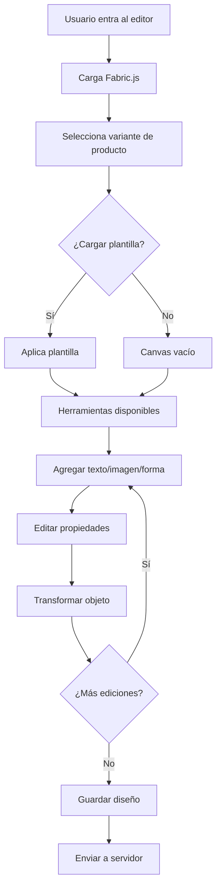
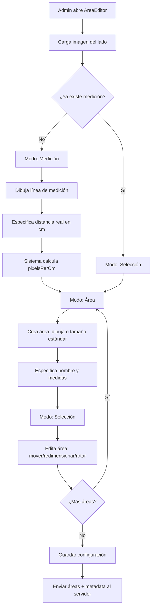

# INFORME DE ANÁLISIS EXHAUSTIVO: EDITORES DEL PROYECTO LOVILIKE

**Fecha:** 2025-11-20
**Objetivo:** Analizar los tres editores existentes para preparar la unificación en un solo editor configurable

---

## TABLA DE CONTENIDOS

1. [Resumen Ejecutivo](#resumen-ejecutivo)
2. [Análisis Individual de Editores](#análisis-individual-de-editores)
   - [ZakekeAdvancedEditor](#1-zakekeadvancededitor)
   - [TemplateEditor](#2-templateeditor)
   - [AreaEditor](#3-areaeditor)
3. [Comparativa Detallada](#comparativa-detallada)
4. [Funcionalidades Comunes](#funcionalidades-comunes)
5. [Funcionalidades Únicas](#funcionalidades-únicas)
6. [Dependencias Técnicas](#dependencias-técnicas)
7. [Propuesta de Unificación](#propuesta-de-unificación)
8. [Beneficios de la Unificación](#beneficios-de-la-unificación)
9. [Retos y Consideraciones](#retos-y-consideraciones)

---

## RESUMEN EJECUTIVO

El proyecto **Lovilike** cuenta actualmente con **tres editores distintos**, cada uno diseñado para un propósito específico:

1. **ZakekeAdvancedEditor** - Para clientes finales en la web pública
2. **TemplateEditor** - Para administradores creando plantillas
3. **AreaEditor** - Para administradores definiendo áreas de impresión

### Hallazgos Clave

- **Código duplicado:** Aproximadamente 60-70% del código es similar entre los tres editores
- **Tecnologías diferentes:** ZakekeAdvancedEditor y TemplateEditor usan Fabric.js (carga dinámica), mientras AreaEditor usa Canvas 2D nativo
- **Coordenadas compatibles:** Los tres usan el mismo sistema dual de coordenadas relativas/absolutas
- **Funcionalidades solapadas:** Herramientas de zoom, selección, transformación, y guardado son prácticamente idénticas

### Conclusión Principal

**SÍ ES VIABLE** unificar los tres editores en uno solo con menús configurables según el contexto de uso (admin/cliente, plantillas/áreas/personalización).

---

## ANÁLISIS INDIVIDUAL DE EDITORES

### 1. ZAKEKE ADVANCED EDITOR

**Archivo:** `src/components/editor/ZakekeAdvancedEditor.tsx`
**Tamaño:** ~59,000 tokens (archivo muy grande)
**Ubicación de uso:** Web pública (`/products/[id]/customize`)
**Usuario:** Cliente final

#### 1.1 Propósito Principal

Editor visual completo que permite a los clientes personalizar productos agregando texto, imágenes y formas sobre las áreas de impresión predefinidas.

#### 1.2 Características Técnicas

**Biblioteca de Renderizado:** Fabric.js (carga dinámica mediante `loadFabricWithPlugins()`)

**Hook Principal:** No usa hooks personalizados, pero gestiona estado complejo con múltiples refs

**Componentes UI Usados:**
- Card, CardContent, CardHeader, CardTitle
- Button, Input, Label, Select, Slider
- Badge, Separator, Switch
- Tabs, TabsList, TabsContent, TabsTrigger

**Dependencias Externas:**
- `fabric.js` - Renderizado del canvas
- `react-hot-toast` - Notificaciones
- `swr` - Fetching de datos
- `@/lib/canvas-utils` - Utilidades de coordenadas

#### 1.3 Estados Principales

```typescript
// Estados de canvas
const [canvas, setCanvas] = useState<fabric.Canvas | null>(null)
const [canvasElements, setCanvasElements] = useState<CanvasElement[]>([])
const [selectedObject, setSelectedObject] = useState<fabric.Object | null>(null)

// Estados de producto
const [activeSide, setActiveSide] = useState<string>('')
const [currentSide, setCurrentSide] = useState<ProductSide | null>(null)
const [activePrintArea, setActivePrintArea] = useState<PrintArea | null>(null)
const [selectedVariant, setSelectedVariant] = useState<string>('')

// Estados de historial y zoom
const [canvasHistory, setCanvasHistory] = useState<HistoryState[]>([])
const [historyIndex, setHistoryIndex] = useState(-1)
const [zoom, setZoom] = useState(1)

// Estados de herramientas
const [imageMovementMode, setImageMovementMode] = useState(false)
const [templateSettings, setTemplateSettings] = useState<TemplateSettings | null>(null)
```

#### 1.4 Funcionalidades Implementadas

**Edición de Texto:**
- ✅ Agregar texto con fuente, tamaño, color personalizable
- ✅ Negrita, cursiva, subrayado, tachado
- ✅ Alineación (izquierda, centro, derecha)
- ✅ Espaciado de letras y líneas
- ✅ Auto-mayúsculas (opcional desde plantilla)
- ✅ Límites de tamaño de fuente (min/max desde plantilla)
- ✅ Texto curvo (si está habilitado en plantilla)

**Edición de Imágenes:**
- ✅ Upload de imágenes desde dispositivo
- ✅ Selección desde galería del producto
- ✅ Recorte y ajuste de imágenes
- ✅ Escalado con/sin mantener proporción
- ✅ Rotación y volteo (horizontal/vertical)
- ✅ Opacidad ajustable
- ✅ Modo de movimiento visual dentro de máscaras

**Edición de Formas:**
- ✅ Formas básicas: triángulo, cuadrado, círculo, estrella, corazón
- ✅ Color de relleno y borde
- ✅ Grosor de borde
- ✅ Opacidad

**Transformaciones:**
- ✅ Mover objetos (drag & drop)
- ✅ Escalar desde esquinas
- ✅ Rotar (control circular)
- ✅ Duplicar objetos
- ✅ Eliminar objetos
- ✅ Cambiar orden z-index (drag en lista de capas)

**Sistema de Capas:**
- ✅ Lista de elementos con nombres editables
- ✅ Drag & drop para reordenar
- ✅ Visibilidad/bloqueo por elemento
- ✅ Indicador de tipo de elemento (ícono)

**Restricciones:**
- ✅ Objetos limitados al área de impresión
- ✅ Permisos de plantilla aplicados (qué puede editar el usuario)
- ✅ Elementos bloqueados no movibles
- ✅ Snap magnético al centro del área de impresión

**Historial:**
- ✅ Undo/Redo completo (últimos 20 estados)
- ✅ Guardado automático de estados tras cada acción

**Zoom:**
- ✅ Control de zoom (0.01x a 20x)
- ✅ Zoom centrado en canvas
- ✅ Botones rápidos: 50%, 100%, 200%

**Plantillas:**
- ✅ Carga de plantillas predefinidas
- ✅ Aplicación de configuraciones de plantilla
- ✅ Respeto de permisos por elemento

**Variantes:**
- ✅ Cambio dinámico de variante (color, tamaño)
- ✅ Actualización de imágenes según variante

**Exportación:**
- ✅ Guardado de diseño completo en JSON
- ✅ Exportación de configuración de canvas
- ✅ Generación de vista previa

#### 1.5 Flujo de Trabajo del Usuario



#### 1.6 Menús y Paneles

**Barra de Herramientas Principal:**
```
[Type] [Image] [Shapes] | [Undo] [Redo] | [Trash] [Copy] | [Settings]
```

**Panel Lateral Izquierdo (Diseño):**
- Selector de lado del producto
- Selector de variante
- Selector de plantilla
- Lista de elementos/capas
- Biblioteca de imágenes
- Biblioteca de formas

**Panel Lateral Derecho (Propiedades):**
- Propiedades del objeto seleccionado
- Campos específicos según tipo (texto/imagen/forma)
- Controles de transformación
- Controles de apariencia

**Canvas Central:**
- Área de trabajo principal
- Herramientas de zoom
- Indicadores de área de impresión
- Objetos seleccionables

#### 1.7 Sistema de Coordenadas

**Tipo:** Dual - Relativo + Absoluto

**Conversión:**
```typescript
// De relativo (%) a absoluto (px)
const absoluteCoords = calculatePrintAreaOnScaledImage(
  relativeCoords,
  imageTransform,
  canvasSize
)

// De absoluto (px) a relativo (%)
const relativeCoords = absoluteToRelative(absoluteCoords, canvasSize)
```

**Escala de Referencia:**
- Píxeles por cm: 11.81 (estándar configurado)
- Canvas size estándar: 800x800px

---

### 2. TEMPLATE EDITOR

**Archivo:** `src/components/admin/templates/TemplateEditor.tsx`
**Tamaño:** ~62,000 tokens (archivo muy grande)
**Ubicación de uso:** Admin panel (`/admin/templates`)
**Usuario:** Administrador

#### 2.1 Propósito Principal

Editor especializado para que administradores creen y editen plantillas de productos que luego serán usadas por clientes en el ZakekeAdvancedEditor.

#### 2.2 Características Técnicas

**Biblioteca de Renderizado:** Fabric.js (carga dinámica, similar a ZakekeAdvancedEditor)

**Hook Principal:** No usa hooks personalizados, pero gestiona estado complejo

**Componentes UI Usados:**
- Los mismos que ZakekeAdvancedEditor
- Adicional: TemplatePreview (vista previa de plantilla)

**Dependencias Externas:**
- `fabric.js` - Renderizado del canvas
- `swr` - Fetching de datos
- `@/lib/canvas-utils` - Utilidades de coordenadas
- ImageLibrary, ShapesLibrary

#### 2.3 Estados Principales

```typescript
// Estados de canvas
const [canvas, setCanvas] = useState<fabric.Canvas | null>(null)
const [elements, setElements] = useState<TemplateElement[]>([])
const [sideElements, setSideElements] = useState<Record<string, TemplateElement[]>>({})
const [selectedElement, setSelectedElement] = useState<string | null>(null)

// Estados de producto
const [currentSide, setCurrentSide] = useState<string>('')
const [productSides, setProductSides] = useState<ProductSide[]>([])

// Estados de plantilla
const [templateSettings, setTemplateSettings] = useState({
  syncAcrossSides: false,
  allowedImageFormats: ['jpg', 'png'],
  maxImageSize: 5, // MB
  // ... más configuraciones
})

// Estados de historial
const [history, setHistory] = useState<HistoryState[]>([])
const [historyIndex, setHistoryIndex] = useState(-1)

// Estados de zoom y vista
const [zoom, setZoom] = useState(1)
const [showPreview, setShowPreview] = useState(false)
```

#### 2.4 Funcionalidades Implementadas

**Edición de Texto (con permisos):**
- ✅ Todas las funcionalidades de ZakekeAdvancedEditor
- ✅ **Adicional:** minFontSize/maxFontSize configurables
- ✅ **Adicional:** letterSpacing, lineSpacing personalizables
- ✅ **Adicional:** autoUppercase (forzar mayúsculas)
- ✅ **Adicional:** mandatoryToEdit (campo obligatorio)
- ✅ **Adicional:** alwaysOnTop/Bottom (z-index fijo)
- ✅ **Adicional:** Permisos granulares (canMove, canRotate, canResize, canDelete, canEditContent)

**Edición de Imágenes (con permisos):**
- ✅ Todas las funcionalidades de ZakekeAdvancedEditor
- ✅ **Adicional:** maintainAspectRatio (forzar proporción)
- ✅ **Adicional:** canReplaceImage (permitir cambio de imagen)
- ✅ **Adicional:** canAddMask (permitir agregar máscara)
- ✅ **Adicional:** canEditMask (permitir editar máscara)
- ✅ **Adicional:** Máscaras con propiedades configurables
- ✅ **Adicional:** Permisos granulares

**Edición de Formas (con permisos):**
- ✅ Todas las funcionalidades de ZakekeAdvancedEditor
- ✅ **Adicional:** useAsFillableShape (forma puede ser rellenada con imagen)
- ✅ **Adicional:** canChangeStrokeColor (permitir cambio de color borde)
- ✅ **Adicional:** canChangeStrokeWidth (permitir cambio de grosor)
- ✅ **Adicional:** Permisos granulares

**Sincronización Multi-Lado:**
- ✅ Sincronizar elementos entre todos los lados
- ✅ Copias independientes por lado
- ✅ Actualización propagada o manual

**Vista Previa:**
- ✅ Preview de cómo se verá la plantilla
- ✅ Visualización con diferentes variantes
- ✅ Exportación de vista previa

**Exportación:**
- ✅ Conversión a coordenadas relativas antes de guardar
- ✅ Guardado de permisos y configuraciones
- ✅ Metadata completa de plantilla

#### 2.5 Diferencias con ZakekeAdvancedEditor

| Característica | ZakekeAdvancedEditor | TemplateEditor |
|---|---|---|
| **Permisos por elemento** | ❌ No | ✅ Sí (granulares) |
| **Límites de font size** | ❌ No | ✅ Sí (min/max) |
| **Sincronización multi-lado** | ❌ No | ✅ Sí |
| **Vista previa de plantilla** | ❌ No | ✅ Sí |
| **Configuración de restricciones** | ❌ No | ✅ Sí |
| **Elementos obligatorios** | ❌ No | ✅ Sí (mandatoryToEdit) |
| **Máscaras configurables** | ❌ No | ✅ Sí |

#### 2.6 Menús y Paneles

**Barra de Herramientas:**
```
[Select] [Type] [Image] [Shapes] | [Undo] [Redo] | [Save] [Preview]
```

**Panel Lateral Izquierdo:**
- Selector de lado del producto
- Opción de sincronización
- Lista de elementos/capas (con iconos de permisos)
- Biblioteca de imágenes del producto
- Biblioteca de formas

**Panel Lateral Derecho (Inspector):**
- **General:** Nombre del elemento, tipo
- **Propiedades:** Según tipo de elemento
- **Permisos:** Checkboxes para cada permiso
  - canMove, canRotate, canResize, canDelete
  - canEditContent (para texto)
  - canReplaceImage (para imágenes)
  - etc.
- **Restricciones:** min/max font size, aspectRatio, etc.
- **Apariencia:** locked, visible, alwaysOnTop, etc.

**Canvas Central:**
- Similar a ZakekeAdvancedEditor
- Indicadores visuales de elementos bloqueados
- Guías de alineación

#### 2.7 Sistema de Coordenadas

**Igual que ZakekeAdvancedEditor**, pero con funciones de conversión adicionales:

```typescript
// Convertir elementos a relativo antes de guardar
const convertElementsToRelative = (elements: TemplateElement[]) => {
  return elements.map(el => ({
    ...el,
    x: (el.x / canvasSize.width) * 100,
    y: (el.y / canvasSize.height) * 100,
    width: (el.width / canvasSize.width) * 100,
    height: (el.height / canvasSize.height) * 100,
  }))
}

// Convertir elementos a absoluto al cargar
const convertElementsToAbsolute = (elements: TemplateElement[]) => {
  return elements.map(el => ({
    ...el,
    x: (el.x / 100) * canvasSize.width,
    y: (el.y / 100) * canvasSize.height,
    width: (el.width / 100) * canvasSize.width,
    height: (el.height / 100) * canvasSize.height,
  }))
}
```

---

### 3. AREA EDITOR

**Archivo:** `src/components/admin/personalization/AreaEditor.tsx`
**Tamaño:** ~1,925 líneas
**Ubicación de uso:** Admin panel (`/admin/personalization`)
**Usuario:** Administrador

#### 3.1 Propósito Principal

Editor especializado para definir las **áreas de impresión** en cada lado de un producto. Estas áreas delimitan dónde los clientes pueden colocar sus diseños.

#### 3.2 Características Técnicas

**Biblioteca de Renderizado:** HTML5 Canvas 2D nativo (NO usa Fabric.js)

**Hook Principal:** No usa hooks personalizados

**Componentes UI Usados:**
- Card, Button, Input, Label, Select
- Separator, Checkbox
- Iconos de lucide-react

**Dependencias Externas:**
- Canvas 2D nativo
- `@/lib/canvas-utils` - Utilidades de coordenadas
- `react-dom` (createPortal para modal)

#### 3.3 Estados Principales

```typescript
// Estados del editor
const [mode, setMode] = useState<'measure' | 'area' | 'select'>('measure')
const [image, setImage] = useState<HTMLImageElement | null>(null)
const [imageLoaded, setImageLoaded] = useState(false)
const [canvasSize, setCanvasSize] = useState(STANDARD_CANVAS_SIZE)
const [imageTransform, setImageTransform] = useState<any>(null)

// Estados de áreas
const [areas, setAreas] = useState<PrintArea[]>([])
const [selectedArea, setSelectedArea] = useState<string | null>(null)
const [tempArea, setTempArea] = useState<{ start: Point, end: Point } | null>(null)

// Estados de medición
const [measurementLines, setMeasurementLines] = useState<MeasurementLine[]>([])
const [pixelsPerCm, setPixelsPerCm] = useState<number | null>(null)
const [isDrawingMeasurement, setIsDrawingMeasurement] = useState(false)
const [measurementStart, setMeasurementStart] = useState<Point | null>(null)
const [tempMeasurementLine, setTempMeasurementLine] = useState<{start: Point, end: Point} | null>(null)

// Estados de configuración
const [mainAreaName, setMainAreaName] = useState('')
const [manualWidth, setManualWidth] = useState('')
const [manualHeight, setManualHeight] = useState('')
const [currentShape, setCurrentShape] = useState<'rectangle' | 'circle' | 'ellipse'>('rectangle')
const [standardSize, setStandardSize] = useState<string>("")

// Estados de transformación
const [isDragging, setIsDragging] = useState(false)
const [isResizing, setIsResizing] = useState(false)
const [isRotating, setIsRotating] = useState(false)
const [dragMode, setDragMode] = useState<'move' | 'resize' | 'rotate' | null>(null)
```

#### 3.4 Funcionalidades Implementadas

**Sistema de Medición:**
- ✅ Dibujar línea de medición (horizontal o vertical)
- ✅ Especificar distancia real en cm
- ✅ Calcular píxeles por cm automáticamente
- ✅ Una medición activa (nueva reemplaza anterior)
- ✅ Recalcular todas las áreas al cambiar medición

**Creación de Áreas:**
- ✅ Dibujar área: rectángulo, círculo, elipse
- ✅ Posicionamiento manual (drag en canvas)
- ✅ Tamaños estándar predefinidos (A2, A3, A4, A5)
- ✅ Medidas manuales en cm (ancho × alto)
- ✅ Nombre personalizado por área
- ✅ Centrado automático opcional

**Edición de Áreas:**
- ✅ Seleccionar área (click)
- ✅ Mover (drag desde control específico)
- ✅ Redimensionar (drag desde esquina)
- ✅ Rotar (botón de rotación en pasos de 45°)
- ✅ Eliminar (botón de eliminar)
- ✅ Editar nombre (inline)
- ✅ Cambiar medidas (panel lateral)

**Herramientas Visuales:**
- ✅ Guías de alineación al centro (líneas azules punteadas)
- ✅ Snap magnético al centro (tolerancia configurable)
- ✅ Controles visuales en esquinas (iconos + colores)
- ✅ Etiqueta flotante con nombre y dimensiones
- ✅ Indicador de coordenadas relativas (emoji 📐)

**Transformaciones:**
- ✅ Mover área (mantiene estado inicial durante drag)
- ✅ Redimensionar desde esquina (mantiene proporciones opcionales)
- ✅ Rotar área en incrementos de 45°
- ✅ Limitar área a los bordes de la imagen (0-100%)

**Proporciones:**
- ✅ Bloquear proporción (link chain icon)
- ✅ Auto-ajuste de alto al cambiar ancho (y viceversa)

**Exportación:**
- ✅ Guardar áreas con coordenadas relativas
- ✅ Guardar metadata de medición (pixelsPerCm)
- ✅ Incluir dimensiones reales en cm

#### 3.5 Diferencias con los Otros Editores

| Característica | AreaEditor | ZakekeAdvancedEditor | TemplateEditor |
|---|---|---|---|
| **Canvas** | Canvas 2D nativo | Fabric.js | Fabric.js |
| **Elementos** | Solo áreas rectangulares | Texto, Imagen, Formas | Texto, Imagen, Formas |
| **Medición** | Configurable por imagen | Estándar fijo | Estándar fijo |
| **Propósito** | Definir límites de impresión | Personalizar producto | Crear plantillas |
| **Complejidad** | Baja (1 tipo de objeto) | Alta (múltiples tipos) | Alta (múltiples tipos + permisos) |
| **Undo/Redo** | ❌ No | ✅ Sí | ✅ Sí |
| **Multi-lado** | Uno a la vez | Sí (variantes) | Sí (sincronización) |

#### 3.6 Menús y Paneles

**Panel Lateral Izquierdo:**

```
┌─────────────────────────────┐
│ Editor de Áreas         [X] │
├─────────────────────────────┤
│ Configuración del Área      │
│ ┌─────────────────────────┐ │
│ │ Nombre: [Logo frontal ] │ │
│ │ Tamaño: [A4 ▼]          │ │
│ │ Ancho:  [21.0] cm       │ │
│ │ Alto:   [29.7] cm  [🔗] │ │
│ │ [Aplicar] [Centro]      │ │
│ └─────────────────────────┘ │
├─────────────────────────────┤
│ Herramientas    Formas      │
│ [📏]            [▢] [●]     │
├─────────────────────────────┤
│ Áreas Creadas               │
│ ┌─────────────────────────┐ │
│ │ Logo frontal            │ │
│ │ rectangle - 21×29.7 cm  │ │
│ │ ✓ Medidas con escala    │ │
│ └─────────────────────────┘ │
│ [+ Crear Nueva Área]        │
├─────────────────────────────┤
│ [Guardar] [Cancelar]        │
└─────────────────────────────┘
```

**Canvas Central:**

```
┌───────────────────────────────────┐
│       Nombre del Lado             │
│  ┌─────────────────────────────┐  │
│  │        ┊  (guía)            │  │
│  │        ┊                    │  │
│  │  ┌─────┴─────────┐          │  │
│  │  │ [×] Logo [↻]  │          │  │
│  │  │ 21.0 × 29.7cm │          │  │
│  │  │               │          │  │
│  │──┼───────────────┼──(guía)  │  │
│  │  │               │          │  │
│  │  │ [✥]       [⤡] │          │  │
│  │  └───────────────┘          │  │
│  │                             │  │
│  └─────────────────────────────┘  │
│  [×]Eliminar [↻]Rotar [✥]Mover   │
│  [⤡]Redimensionar                │
└───────────────────────────────────┘
```

#### 3.7 Flujo de Trabajo del Usuario



#### 3.8 Sistema de Coordenadas

**Igual sistema dual que los otros editores:**

```typescript
// Conversión de coordenadas del canvas a relativas sobre imagen
const canvasToImageCoordinates = (canvasCoords) => {
  const relativeX = ((canvasCoords.x - imageLeft) / imageWidth) * 100
  const relativeY = ((canvasCoords.y - imageTop) / imageHeight) * 100
  const relativeWidth = (canvasCoords.width / imageWidth) * 100
  const relativeHeight = (canvasCoords.height / imageHeight) * 100

  return { x: relativeX, y: relativeY, width: relativeWidth, height: relativeHeight }
}

// Snap al centro con tolerancia
const snapToCenter = (point, tolerance = 15) => {
  const centerX = canvasSize.width / 2
  const centerY = canvasSize.height / 2

  if (Math.abs(point.x - centerX) < tolerance) point.x = centerX
  if (Math.abs(point.y - centerY) < tolerance) point.y = centerY

  return point
}
```

**Característica única:** Sistema de medición configurable

```typescript
// Calcular escala
const pixelDistance = Math.sqrt(
  Math.pow(end.x - start.x, 2) + Math.pow(end.y - start.y, 2)
)
const pixelsPerCm = pixelDistance / realDistanceInCm
```

---

## COMPARATIVA DETALLADA

### Tabla Comparativa Exhaustiva

| Aspecto | ZakekeAdvancedEditor | TemplateEditor | AreaEditor |
|---------|---------------------|----------------|------------|
| **CONTEXTO** |
| Ubicación | `/products/[id]/customize` | `/admin/templates` | `/admin/personalization` |
| Usuario | Cliente final | Admin | Admin |
| Propósito | Personalizar producto | Crear plantillas | Definir áreas impresión |
| **TECNOLOGÍA** |
| Canvas | Fabric.js (dinámico) | Fabric.js (dinámico) | Canvas 2D nativo |
| Tamaño del archivo | ~59k tokens | ~62k tokens | ~1,925 líneas |
| Hooks personalizados | ❌ No | ❌ No | ❌ No |
| **ELEMENTOS** |
| Texto | ✅ Completo | ✅ Completo + permisos | ❌ No aplica |
| Imagen | ✅ Completo | ✅ Completo + permisos | ❌ No aplica |
| Forma | ✅ Completo | ✅ Completo + permisos | ✅ Solo áreas |
| **HERRAMIENTAS** |
| Zoom | ✅ 0.01x a 20x | ✅ Similar | ❌ No |
| Undo/Redo | ✅ 20 estados | ✅ 50 estados | ❌ No |
| Snap al centro | ✅ Magnético | ✅ Magnético | ✅ Con guías |
| Drag & drop capas | ✅ Sí | ✅ Sí | ❌ No aplica |
| **COORDENADAS** |
| Sistema | Relativo + Absoluto | Relativo + Absoluto | Relativo + Absoluto |
| Funciones | `calculatePrintAreaOnScaledImage` | Igual + conversión bulk | Igual + conversión manual |
| Escala | 11.81 px/cm fijo | 11.81 px/cm fijo | Configurable por imagen |
| **RESTRICCIONES** |
| Área de impresión | ✅ Enforced (bloqueo) | ✅ Visual | ✅ Define las áreas |
| Permisos elementos | ❌ No | ✅ Granulares | ❌ No aplica |
| Límites font size | ❌ No | ✅ min/max | ❌ No aplica |
| **MULTI-LADO** |
| Soporte | ✅ Con variantes | ✅ Con sincronización | ⚠️ Uno a la vez |
| Cambio de lado | ✅ Tabs | ✅ Tabs | ❌ Modal separado |
| **EXPORTACIÓN** |
| Formato | JSON canvas | JSON + metadata | Array áreas + medición |
| Conversión | Auto (al guardar) | Manual (función) | Manual (función) |
| **UI/UX** |
| Complejidad | Alta | Alta | Baja |
| Paneles laterales | 2 (izq/der) | 2 (izq/der) | 1 (izq) |
| Modal/Inline | Inline | Inline | Modal (portal) |
| **CARACTERÍSTICAS ÚNICAS** |
| - | imageMovementMode | Permisos granulares | Sistema de medición |
| - | Plantillas | Vista previa | Tamaños estándar (A4, etc.) |
| - | Variantes producto | Sincronización multi-lado | Guías de alineación |

---

## FUNCIONALIDADES COMUNES

### 1. Sistema de Coordenadas

**Los tres editores usan el mismo sistema:**

```typescript
// Importan desde @/lib/canvas-utils
import {
  STANDARD_CANVAS_SIZE,
  absoluteToRelative,
  relativeToAbsolute,
  scaleImageToCanvas,
  calculatePrintAreaOnScaledImage
}
```

**Flujo común:**
1. Imagen se carga y se escala al canvas estándar (800x800)
2. Se calcula la transformación de la imagen (`scaleImageToCanvas`)
3. Las coordenadas de elementos se convierten entre:
   - **Relativas (0-100%)** - para guardar en BD
   - **Absolutas (píxeles)** - para renderizar en canvas
4. Al guardar, todo se convierte a relativo
5. Al cargar, todo se convierte a absoluto

### 2. Transformaciones de Objetos

**Operaciones comunes:**
- ✅ Mover (drag & drop)
- ✅ Escalar (desde esquinas)
- ✅ Rotar (control circular o botón)
- ✅ Duplicar/Eliminar

**Implementación similar:**
```typescript
// Estado de drag
const [isDragging, setIsDragging] = useState(false)
const [dragStart, setDragStart] = useState<Point | null>(null)

// Handlers
const handleMouseDown = (event) => { /* ... */ }
const handleMouseMove = (event) => { /* ... */ }
const handleMouseUp = () => { /* ... */ }
```

### 3. Gestión de Canvas

**Patrón común:**
```typescript
const canvasRef = useRef<HTMLCanvasElement>(null)

useEffect(() => {
  if (imageLoaded) {
    drawCanvas()
  }
}, [dependencies])

const drawCanvas = () => {
  const canvas = canvasRef.current
  const ctx = canvas?.getContext('2d')
  // ... renderizado
}
```

### 4. Lista de Elementos/Capas

**Interfaz similar:**
- Lista vertical de elementos
- Nombre editable inline
- Iconos de tipo (texto/imagen/forma)
- Controles de visibilidad/bloqueo
- Selección por click

### 5. Panel de Propiedades

**Estructura similar:**
- Según tipo de objeto seleccionado
- Campos de entrada para valores numéricos
- Sliders para valores con rango (opacidad, rotación)
- Pickers de color
- Botones de acción

---

## FUNCIONALIDADES ÚNICAS

### ZakekeAdvancedEditor

1. **imageMovementMode** - Modo visual para mover imágenes dentro de máscaras
2. **Plantillas cargables** - Puede cargar y aplicar plantillas predefinidas
3. **Variantes de producto** - Cambio dinámico de color/tamaño
4. **Restricciones enforced** - Los objetos NO pueden salir del área de impresión
5. **Biblioteca de imágenes del producto** - Galería específica del producto

### TemplateEditor

1. **Permisos granulares** - Control detallado de qué puede editar el usuario
2. **Sincronización multi-lado** - Propagar elementos a todos los lados
3. **Vista previa** - Generación de preview de la plantilla
4. **Límites de font size** - min/max configurables
5. **Elementos obligatorios** - `mandatoryToEdit` flag
6. **Máscaras configurables** - Propiedades avanzadas de máscaras
7. **alwaysOnTop/Bottom** - Control de z-index fijo

### AreaEditor

1. **Sistema de medición** - Calibración manual de escala (pixelsPerCm)
2. **Tamaños estándar** - Presets A2, A3, A4, A5
3. **Guías de alineación** - Líneas centrales visuales
4. **Snap con tolerancia** - Ajuste magnético configurable
5. **Medidas reales** - Especificación directa en cm
6. **Canvas 2D nativo** - No depende de Fabric.js
7. **Recalculación automática** - Al cambiar medición, recalcula todas las áreas

---

## DEPENDENCIAS TÉCNICAS

### Dependencias Comunes

```json
{
  "react": "^18.x",
  "react-dom": "^18.x",
  "lucide-react": "icons",
  "@/components/ui/*": "shadcn/ui components"
}
```

### Dependencias Específicas

**ZakekeAdvancedEditor + TemplateEditor:**
```json
{
  "fabric": "^5.x (carga dinámica)",
  "react-hot-toast": "^2.x",
  "swr": "^2.x"
}
```

**AreaEditor:**
```json
{
  "react-dom": "createPortal"
}
```

### Utilidades Compartidas

**Archivo:** `@/lib/canvas-utils`

```typescript
export const STANDARD_CANVAS_SIZE = { width: 800, height: 800 }

export interface RelativeCoordinates {
  x: number      // 0-100%
  y: number      // 0-100%
  width: number  // 0-100%
  height: number // 0-100%
}

export interface AbsoluteCoordinates {
  x: number      // píxeles
  y: number      // píxeles
  width: number  // píxeles
  height: number // píxeles
}

export function absoluteToRelative(coords: AbsoluteCoordinates, canvasSize): RelativeCoordinates
export function relativeToAbsolute(coords: RelativeCoordinates, canvasSize): AbsoluteCoordinates
export function scaleImageToCanvas(imageSize, canvasSize): ImageTransform
export function calculatePrintAreaOnScaledImage(relative, transform, canvasSize): AbsoluteCoordinates
```

---

## PROPUESTA DE UNIFICACIÓN

### Arquitectura del Editor Unificado

**Nombre propuesto:** `UniversalEditor`

### 1. Configuración por Contexto

```typescript
interface EditorConfig {
  mode: 'customer' | 'template' | 'area'
  features: EditorFeatures
  ui: UIConfig
  permissions: PermissionSet
}

interface EditorFeatures {
  // Elementos
  enableText: boolean
  enableImages: boolean
  enableShapes: boolean
  enableAreas: boolean

  // Herramientas
  enableZoom: boolean
  enableUndo: boolean
  enableSnap: boolean
  enableMeasurement: boolean

  // Funcionalidades avanzadas
  enablePermissions: boolean
  enableTemplates: boolean
  enableVariants: boolean
  enableMultiSide: boolean
  enableSync: boolean

  // Restricciones
  enforceAreaLimits: boolean
  enableLocking: boolean
}

interface UIConfig {
  showLeftPanel: boolean
  showRightPanel: boolean
  showTopToolbar: boolean
  enableModal: boolean
  panels: {
    design?: boolean
    properties?: boolean
    layers?: boolean
    images?: boolean
    shapes?: boolean
    measurement?: boolean
  }
}
```

### 2. Configuraciones Predefinidas

```typescript
const EDITOR_CONFIGS = {
  customer: {
    mode: 'customer',
    features: {
      enableText: true,
      enableImages: true,
      enableShapes: true,
      enableAreas: false,
      enableZoom: true,
      enableUndo: true,
      enableSnap: true,
      enableMeasurement: false,
      enablePermissions: false,  // Respeta permisos pero no los edita
      enableTemplates: true,     // Puede cargar plantillas
      enableVariants: true,      // Puede cambiar variantes
      enableMultiSide: true,
      enableSync: false,
      enforceAreaLimits: true,   // Restricción absoluta
      enableLocking: true,       // Elementos bloqueados
    },
    ui: {
      showLeftPanel: true,
      showRightPanel: true,
      showTopToolbar: true,
      enableModal: false,
      panels: {
        design: true,
        properties: true,
        layers: true,
        images: true,
        shapes: true,
        measurement: false,
      }
    }
  },

  template: {
    mode: 'template',
    features: {
      enableText: true,
      enableImages: true,
      enableShapes: true,
      enableAreas: false,
      enableZoom: true,
      enableUndo: true,
      enableSnap: true,
      enableMeasurement: false,
      enablePermissions: true,   // Puede editar permisos
      enableTemplates: false,
      enableVariants: false,
      enableMultiSide: true,
      enableSync: true,          // Sincronización multi-lado
      enforceAreaLimits: false,  // Visual solamente
      enableLocking: true,
    },
    ui: {
      showLeftPanel: true,
      showRightPanel: true,
      showTopToolbar: true,
      enableModal: false,
      panels: {
        design: true,
        properties: true,
        layers: true,
        images: true,
        shapes: true,
        measurement: false,
      }
    }
  },

  area: {
    mode: 'area',
    features: {
      enableText: false,
      enableImages: false,
      enableShapes: false,
      enableAreas: true,
      enableZoom: false,
      enableUndo: false,
      enableSnap: true,
      enableMeasurement: true,   // Sistema de medición
      enablePermissions: false,
      enableTemplates: false,
      enableVariants: false,
      enableMultiSide: false,
      enableSync: false,
      enforceAreaLimits: false,
      enableLocking: false,
    },
    ui: {
      showLeftPanel: true,
      showRightPanel: false,
      showTopToolbar: true,
      enableModal: true,         // Se muestra como modal
      panels: {
        design: false,
        properties: false,
        layers: false,
        images: false,
        shapes: false,
        measurement: true,
      }
    }
  }
}
```

### 3. Estructura de Componentes

```
UniversalEditor/
├── index.tsx                    # Componente principal
├── hooks/
│   ├── useEditorCore.ts         # Lógica central del editor
│   ├── useCanvas.ts             # Gestión del canvas (Fabric.js o Canvas2D)
│   ├── useCoordinates.ts        # Sistema de coordenadas
│   ├── useHistory.ts            # Undo/Redo
│   ├── useZoom.ts               # Control de zoom
│   ├── useMeasurement.ts        # Sistema de medición
│   └── usePermissions.ts        # Sistema de permisos
├── components/
│   ├── Canvas/
│   │   ├── FabricCanvas.tsx     # Canvas basado en Fabric.js
│   │   ├── NativeCanvas.tsx     # Canvas 2D nativo
│   │   └── CanvasWrapper.tsx    # Selector automático según config
│   ├── Panels/
│   │   ├── LeftPanel/
│   │   │   ├── DesignPanel.tsx
│   │   │   ├── LayersPanel.tsx
│   │   │   ├── ImageLibrary.tsx
│   │   │   ├── ShapesLibrary.tsx
│   │   │   └── MeasurementPanel.tsx
│   │   └── RightPanel/
│   │       ├── PropertiesPanel.tsx
│   │       ├── TextProperties.tsx
│   │       ├── ImageProperties.tsx
│   │       ├── ShapeProperties.tsx
│   │       └── PermissionsPanel.tsx
│   ├── Toolbar/
│   │   ├── MainToolbar.tsx
│   │   ├── ToolButton.tsx
│   │   └── ZoomControls.tsx
│   └── Elements/
│       ├── TextElement.tsx
│       ├── ImageElement.tsx
│       ├── ShapeElement.tsx
│       └── AreaElement.tsx
├── context/
│   └── EditorContext.tsx        # Contexto global del editor
└── types/
    ├── EditorConfig.ts
    ├── Elements.ts
    └── Canvas.ts
```

### 4. Uso del Editor Unificado

**Ejemplo 1: Cliente personalizando producto**
```tsx
import UniversalEditor from '@/components/UniversalEditor'
import { EDITOR_CONFIGS } from '@/components/UniversalEditor/configs'

function ProductCustomizePage() {
  return (
    <UniversalEditor
      config={EDITOR_CONFIGS.customer}
      productId={productId}
      onSave={handleSaveCustomization}
    />
  )
}
```

**Ejemplo 2: Admin creando plantilla**
```tsx
import UniversalEditor from '@/components/UniversalEditor'
import { EDITOR_CONFIGS } from '@/components/UniversalEditor/configs'

function TemplateEditorPage() {
  return (
    <UniversalEditor
      config={EDITOR_CONFIGS.template}
      templateId={templateId}
      onSave={handleSaveTemplate}
    />
  )
}
```

**Ejemplo 3: Admin definiendo áreas**
```tsx
import UniversalEditor from '@/components/UniversalEditor'
import { EDITOR_CONFIGS } from '@/components/UniversalEditor/configs'

function AreaEditorModal() {
  return (
    <UniversalEditor
      config={EDITOR_CONFIGS.area}
      sideImage={sideImage}
      sideName={sideName}
      onSave={handleSaveAreas}
      onClose={handleClose}
    />
  )
}
```

### 5. Renderizado Condicional

```tsx
export default function UniversalEditor({ config, ...props }) {
  // Selector de canvas según modo
  const CanvasComponent = config.mode === 'area'
    ? NativeCanvas
    : FabricCanvas

  return (
    <EditorContext.Provider value={{ config, ...editorState }}>
      <div className="editor-layout">
        {/* Toolbar superior */}
        {config.ui.showTopToolbar && (
          <Toolbar config={config} />
        )}

        <div className="editor-content">
          {/* Panel izquierdo */}
          {config.ui.showLeftPanel && (
            <LeftPanel config={config}>
              {config.ui.panels.design && <DesignPanel />}
              {config.ui.panels.layers && <LayersPanel />}
              {config.ui.panels.images && <ImageLibrary />}
              {config.ui.panels.shapes && <ShapesLibrary />}
              {config.ui.panels.measurement && <MeasurementPanel />}
            </LeftPanel>
          )}

          {/* Canvas central */}
          <CanvasComponent config={config} {...props} />

          {/* Panel derecho */}
          {config.ui.showRightPanel && (
            <RightPanel config={config}>
              {config.ui.panels.properties && <PropertiesPanel />}
            </RightPanel>
          )}
        </div>
      </div>
    </EditorContext.Provider>
  )
}
```

### 6. Hook Principal: useEditorCore

```typescript
export function useEditorCore(config: EditorConfig) {
  // Estados centrales
  const [elements, setElements] = useState<EditorElement[]>([])
  const [selectedElement, setSelectedElement] = useState<string | null>(null)
  const [canvas, setCanvas] = useState<Canvas | null>(null)

  // Hooks condicionales según config
  const history = config.features.enableUndo
    ? useHistory(elements)
    : null

  const zoom = config.features.enableZoom
    ? useZoom()
    : null

  const measurement = config.features.enableMeasurement
    ? useMeasurement()
    : null

  // Funciones centrales
  const addElement = (element: EditorElement) => {
    if (!canAddElement(element, config)) return

    setElements(prev => [...prev, element])
    if (history) history.push([...elements, element])
  }

  const updateElement = (id: string, updates: Partial<EditorElement>) => {
    if (!canUpdateElement(id, updates, config)) return

    setElements(prev => prev.map(el =>
      el.id === id ? { ...el, ...updates } : el
    ))
    if (history) history.push(elements)
  }

  const deleteElement = (id: string) => {
    if (!canDeleteElement(id, config)) return

    setElements(prev => prev.filter(el => el.id !== id))
    if (history) history.push(elements.filter(el => el.id !== id))
  }

  return {
    // Estado
    elements,
    selectedElement,
    canvas,

    // Acciones
    addElement,
    updateElement,
    deleteElement,
    selectElement: setSelectedElement,

    // Features condicionales
    history,
    zoom,
    measurement,
  }
}
```

### 7. Validaciones según Contexto

```typescript
function canAddElement(element: EditorElement, config: EditorConfig): boolean {
  // En modo área, solo se permiten áreas
  if (config.mode === 'area' && element.type !== 'area') {
    return false
  }

  // En modo customer, no se permiten áreas
  if (config.mode === 'customer' && element.type === 'area') {
    return false
  }

  // Verificar si el tipo está habilitado
  if (element.type === 'text' && !config.features.enableText) return false
  if (element.type === 'image' && !config.features.enableImages) return false
  if (element.type === 'shape' && !config.features.enableShapes) return false

  return true
}

function canUpdateElement(
  id: string,
  updates: Partial<EditorElement>,
  config: EditorConfig
): boolean {
  const element = elements.find(el => el.id === id)
  if (!element) return false

  // En modo customer, respetar permisos de plantilla
  if (config.mode === 'customer') {
    if (updates.x !== undefined || updates.y !== undefined) {
      if (!element.permissions?.canMove) return false
    }
    if (updates.rotation !== undefined) {
      if (!element.permissions?.canRotate) return false
    }
    if (updates.width !== undefined || updates.height !== undefined) {
      if (!element.permissions?.canResize) return false
    }
  }

  // En modo template, permitir todo (está creando la plantilla)
  if (config.mode === 'template') {
    return true
  }

  return true
}
```

---

## BENEFICIOS DE LA UNIFICACIÓN

### 1. Reducción de Código

**Código actual:**
- ZakekeAdvancedEditor: ~59k tokens
- TemplateEditor: ~62k tokens
- AreaEditor: ~1,925 líneas
- **Total:** ~125k tokens

**Código unificado estimado:**
- UniversalEditor core: ~40k tokens
- Configuraciones: ~5k tokens
- Componentes reutilizables: ~20k tokens
- **Total:** ~65k tokens

**Ahorro:** ~48% de código

### 2. Mantenibilidad

- ✅ Un solo lugar para corregir bugs
- ✅ Mejoras se propagan a todos los editores
- ✅ Código más fácil de testear
- ✅ Menos duplicación de lógica

### 3. Consistencia de UX

- ✅ Misma interfaz en todos los editores
- ✅ Atajos de teclado consistentes
- ✅ Comportamiento predecible
- ✅ Curva de aprendizaje reducida

### 4. Facilidad de Extensión

- ✅ Agregar nueva funcionalidad una sola vez
- ✅ Activar/desactivar features por configuración
- ✅ Crear nuevos modos fácilmente (ej: "preview", "export")

### 5. Performance

- ✅ Carga dinámica de Fabric.js solo cuando necesario
- ✅ Canvas nativo para editores simples (área)
- ✅ Code splitting más eficiente

### 6. Testing

- ✅ Suite de tests unificada
- ✅ Casos de test reutilizables
- ✅ Mocking simplificado

---

## RETOS Y CONSIDERACIONES

### 1. Complejidad Inicial

**Reto:** El editor unificado será más complejo que cada editor individual

**Mitigación:**
- Separar en módulos pequeños y enfocados
- Documentación exhaustiva de cada config
- Tests comprehensivos
- Usar TypeScript para type safety

### 2. Rendimiento

**Reto:** Cargar código no usado en cada modo

**Mitigación:**
- Code splitting agresivo
- Lazy loading de componentes pesados
- Conditional imports para Fabric.js vs Canvas2D
- Bundle analyzer para optimizar

### 3. Retrocompatibilidad

**Reto:** Migrar datos existentes de los tres editores

**Mitigación:**
- Mantener formatos de datos compatibles
- Crear migrations para datos legacy
- Periodo de transición con ambos sistemas activos
- Scripts de validación de datos

### 4. Casos Edge

**Reto:** Funcionalidades muy específicas de un editor

**Mitigación:**
- Usar plugins/extensiones para features específicas
- Sistema de middlewares para lógica personalizada
- Configuración granular de features

### 5. Testing

**Reto:** Testear todas las combinaciones de configuración

**Mitigación:**
- Tests parametrizados con cada configuración
- Tests de integración para flujos completos
- Visual regression testing
- User acceptance testing con usuarios reales

### 6. Migración Gradual

**Plan sugerido:**

**Fase 1: Preparación (1-2 semanas)**
- Crear estructura base del UniversalEditor
- Implementar sistema de configuración
- Setup de hooks centrales

**Fase 2: AreaEditor (1 semana)**
- Migrar AreaEditor primero (el más simple)
- Testear en entorno de desarrollo
- Validar con datos reales

**Fase 3: ZakekeAdvancedEditor (2-3 semanas)**
- Migrar editor de cliente
- Testear extensivamente con productos reales
- Validar rendimiento

**Fase 4: TemplateEditor (2-3 semanas)**
- Migrar editor de plantillas
- Validar creación y edición de plantillas
- Testear sincronización multi-lado

**Fase 5: Refinamiento (1-2 semanas)**
- Optimizaciones de performance
- Pulir UX
- Documentación final
- Capacitación a equipo

**Total estimado: 7-11 semanas**

---

## CONCLUSIONES Y RECOMENDACIONES

### Viabilidad: ✅ ALTA

La unificación de los tres editores en uno solo es **totalmente viable** y **altamente recomendada**.

### Razones Principales:

1. **Alto solapamiento funcional** - 60-70% del código es similar
2. **Misma base tecnológica** - Todos usan React, mismo sistema de coordenadas
3. **Beneficios claros** - Reducción de código, mejor mantenibilidad
4. **Riesgos manejables** - Con plan de migración gradual

### Recomendaciones:

1. **Comenzar con AreaEditor**
   - Es el más simple
   - Buen punto de partida para validar arquitectura
   - Menor riesgo

2. **Invertir en infraestructura compartida**
   - Hooks reutilizables robustos
   - Sistema de coordenadas bien testeado
   - Utilidades comunes

3. **Diseño modular desde el inicio**
   - Componentes pequeños y enfocados
   - Separation of concerns estricta
   - Interfaces bien definidas

4. **Testing comprehensivo**
   - Unit tests para cada hook
   - Integration tests para cada configuración
   - E2E tests para flujos críticos

5. **Documentación continua**
   - Documentar mientras se desarrolla
   - Ejemplos de uso para cada configuración
   - Guías de troubleshooting

### Próximos Pasos Sugeridos:

1. **Revisar y aprobar este informe**
2. **Crear POC (Proof of Concept)** con AreaEditor
3. **Validar arquitectura propuesta**
4. **Planificar sprint de desarrollo**
5. **Iniciar implementación gradual**

---

**Fin del Informe**

---

## ANEXO: Diagrama de Arquitectura

```
┌─────────────────────────────────────────────────────────────┐
│                      UniversalEditor                         │
│                                                              │
│  ┌────────────────────────────────────────────────────────┐ │
│  │                    EditorConfig                        │ │
│  │  - mode: 'customer' | 'template' | 'area'             │ │
│  │  - features: EditorFeatures                           │ │
│  │  - ui: UIConfig                                       │ │
│  │  - permissions: PermissionSet                         │ │
│  └────────────────────────────────────────────────────────┘ │
│                             │                                │
│                             ▼                                │
│  ┌────────────────────────────────────────────────────────┐ │
│  │                  EditorContext                         │ │
│  │  - estado global                                      │ │
│  │  - funciones centrales                                │ │
│  └────────────────────────────────────────────────────────┘ │
│                             │                                │
│         ┌───────────────────┴───────────────────┐           │
│         ▼                   ▼                   ▼           │
│  ┌─────────────┐   ┌──────────────┐   ┌────────────────┐  │
│  │ LeftPanel   │   │ Canvas       │   │  RightPanel    │  │
│  │             │   │              │   │                │  │
│  │ - Design    │   │ Fabric.js    │   │ - Properties   │  │
│  │ - Layers    │   │   OR         │   │ - Permissions  │  │
│  │ - Images    │   │ Canvas2D     │   │                │  │
│  │ - Shapes    │   │              │   │                │  │
│  │ - Measure   │   │              │   │                │  │
│  └─────────────┘   └──────────────┘   └────────────────┘  │
│                                                              │
│  ┌────────────────────────────────────────────────────────┐ │
│  │                        Hooks                           │ │
│  │ - useEditorCore  - useCanvas    - useCoordinates      │ │
│  │ - useHistory     - useZoom      - useMeasurement      │ │
│  │ - usePermissions                                      │ │
│  └────────────────────────────────────────────────────────┘ │
└─────────────────────────────────────────────────────────────┘
                             │
                             ▼
                    ┌────────────────┐
                    │  canvas-utils  │
                    │  - Coordenadas │
                    │  - Escalado    │
                    └────────────────┘
```

## ANEXO: Ejemplo de Código del Editor Unificado

```tsx
// UniversalEditor/index.tsx
import React from 'react'
import { EditorProvider } from './context/EditorContext'
import { useEditorCore } from './hooks/useEditorCore'
import LeftPanel from './components/Panels/LeftPanel'
import RightPanel from './components/Panels/RightPanel'
import CanvasWrapper from './components/Canvas/CanvasWrapper'
import Toolbar from './components/Toolbar/MainToolbar'

interface UniversalEditorProps {
  config: EditorConfig
  // Props específicos según modo
  productId?: string
  templateId?: string
  sideImage?: string
  sideName?: string
  onSave: (data: any) => void
  onClose?: () => void
}

export default function UniversalEditor({
  config,
  onSave,
  onClose,
  ...props
}: UniversalEditorProps) {
  const editorCore = useEditorCore(config)

  const handleSave = () => {
    const data = editorCore.exportData()
    onSave(data)
  }

  return (
    <EditorProvider value={{ config, ...editorCore }}>
      <div className="universal-editor">
        {config.ui.showTopToolbar && (
          <Toolbar onSave={handleSave} onClose={onClose} />
        )}

        <div className="editor-content">
          {config.ui.showLeftPanel && <LeftPanel />}

          <CanvasWrapper {...props} />

          {config.ui.showRightPanel && <RightPanel />}
        </div>
      </div>
    </EditorProvider>
  )
}

// Exportar configs predefinidas
export { EDITOR_CONFIGS } from './configs'
```
