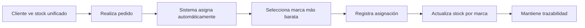

# 🏷️ Sistema de Gestión de Stock Multi-Marca - Lovilike

## 📋 Descripción

El sistema multi-marca permite gestionar inventario por marcas específicas mientras se muestra un stock unificado al cliente. Esto resuelve el problema de tener múltiples proveedores para el mismo producto con diferentes precios y características.

## 🎯 Problema Resuelto

**Antes:**
- Cliente ve: "Camiseta Premium" → 15 unidades
- Realidad interna: No sabemos si son Roly o JHK
- No hay optimización de costes en la selección

**Ahora:**
- Cliente ve: "Camiseta Premium" → 15 unidades
- Realidad interna: 10 Roly (€8.50) + 5 JHK (€7.20) = 15 total
- Sistema elige automáticamente la opción más económica
- Trazabilidad completa de qué marca se entregó

## 🏗️ Arquitectura del Sistema

### Tablas Principales

1. **BrandStock** - Stock por marca específica
   - `variantId` - Referencia a ProductVariant
   - `brand` - Nombre de la marca (Roly, JHK, B&C, etc.)
   - `quantity` - Stock disponible
   - `costPrice` - Precio de coste
   - `location` - Ubicación física
   - `isPreferred` - Marca preferida
   - `priority` - Orden de selección (0 = mayor prioridad)

2. **BrandStockMovement** - Historial de movimientos
   - Registro completo de entradas/salidas
   - Conecta movimientos con pedidos específicos
   - Auditoría completa

3. **OrderItemAllocation** - Asignaciones por pedido
   - Registra exactamente qué marca se entregó
   - Permite trazabilidad completa
   - Estado de cumplimiento

### Flujo de Funcionamiento



## 🚀 Instalación y Configuración

### 1. Aplicar Migración de Base de Datos

```bash
# Aplicar nueva estructura
npx prisma migrate dev --name add-multi-brand-stock-system

# Verificar que se aplicó correctamente
npx prisma db pull
```

### 2. Migrar Datos Existentes

```bash
# Migrar productos existentes al sistema multi-marca
node scripts/migrate-to-multibrand.js

# Verificar la migración
node scripts/verify-migration.js

# Si hay inconsistencias, repararlas
node scripts/verify-migration.js repair
```

### 3. Configurar Proveedores

1. Ir a `/admin/suppliers`
2. Añadir o verificar proveedores existentes
3. Configurar información de contacto y precios

## 📖 Guía de Uso

### Para Administradores

#### 1. Gestión desde Inventario

1. **Acceder a inventario:** `/admin/inventory`
2. **Seleccionar variante:** Click en el botón naranja 📦
3. **Gestionar marcas:**
   - Añadir nueva marca/proveedor
   - Ajustar cantidades por marca
   - Configurar prioridades y preferencias
   - Establecer ubicaciones

#### 2. Gestión desde Productos

1. **Editar producto:** `/admin/products/[id]/edit`
2. **Pestaña "Stock Multi-Marca"**
3. **Por cada variante:**
   - Configurar stock por marca
   - Establecer precios de coste
   - Definir ubicaciones y lotes

#### 3. Visualización en Pedidos

1. **Ver pedido:** `/admin/orders/[id]`
2. **En cada item del pedido:**
   - Ver qué marca específica se asignó
   - Cantidad por marca
   - Coste real del producto

### APIs Disponibles

#### Gestión de Stock por Marca

```javascript
// Obtener resumen de stock por marca
GET /api/brand-stock?variantId=VARIANT_ID

// Crear nuevo stock de marca
POST /api/brand-stock
{
  "variantId": "variant_id",
  "brand": "Roly",
  "quantity": 10,
  "costPrice": 8.50,
  "location": "Estantería A-3"
}

// Ajustar stock
PATCH /api/brand-stock/[id]
{
  "quantity": 15,
  "reason": "Reposición de inventario"
}
```

#### Asignación Automática

```javascript
// Simular asignación
POST /api/brand-stock/allocate
{
  "variantId": "variant_id",
  "quantity": 5,
  "preview": true
}

// Aplicar asignación real
POST /api/brand-stock/allocate
{
  "variantId": "variant_id", 
  "quantity": 5,
  "orderItemId": "order_item_id"
}
```

## 🔧 Algoritmo de Selección

El sistema selecciona automáticamente las marcas siguiendo este orden:

1. **Marcas preferidas** (`isPreferred: true`)
2. **Prioridad** (menor número = mayor prioridad)
3. **Precio de coste** (más barato primero)
4. **Stock disponible** (mayor cantidad primero)

```javascript
// Ejemplo de selección para pedido de 7 unidades:
// Disponible: 3 Roly (€8.50), 5 JHK (€7.20), 2 B&C (€9.00)
// Resultado: 5 JHK + 2 Roly = 7 total (optimiza coste)
```

## 📊 Casos de Uso

### Caso 1: Reposición Inteligente

```javascript
// El sistema detecta que Roly tiene stock bajo
// Genera alerta específica para reposición
// Mantiene registro de proveedores preferidos
```

### Caso 2: Optimización de Costes

```javascript
// Cliente pide 10 camisetas
// Sistema tiene: 6 económicas + 8 premium disponibles  
// Asigna primero las 6 económicas, luego 4 premium
// Ahorra costes automáticamente
```

### Caso 3: Trazabilidad Completa

```javascript
// Cliente reporta problema con producto
// Sistema identifica: Marca X, Lote Y, Fecha Z
// Permite identificar otros productos del mismo lote
```

## 🧪 Testing

### Pruebas Manuales

1. **Crear nuevo stock de marca:**
   ```bash
   # Ir a /admin/inventory
   # Seleccionar variante
   # Añadir Roly: 10 unidades a €8.50
   # Añadir JHK: 5 unidades a €7.20
   # Verificar stock total: 15 unidades
   ```

2. **Probar asignación automática:**
   ```bash
   # Crear pedido de 7 unidades
   # Verificar que asigna 5 JHK + 2 Roly
   # Confirmar que stock se actualiza correctamente
   ```

3. **Verificar trazabilidad:**
   ```bash
   # Ver detalles del pedido
   # Confirmar asignaciones específicas por marca
   # Verificar movimientos en historial
   ```

### Pruebas de API

```bash
# Probar creación de stock
curl -X POST /api/brand-stock \
  -H "Content-Type: application/json" \
  -d '{
    "variantId": "variant_id",
    "brand": "Roly", 
    "quantity": 10,
    "costPrice": 8.50
  }'

# Probar asignación
curl -X POST /api/brand-stock/allocate \
  -H "Content-Type: application/json" \
  -d '{
    "variantId": "variant_id",
    "quantity": 5,
    "preview": true
  }'
```

## 🚨 Solución de Problemas

### Stock Inconsistente

**Problema:** El stock agregado no coincide con la suma de marcas

**Solución:**
```bash
node scripts/verify-migration.js repair
```

### Asignaciones Erróneas

**Problema:** Se asignan marcas incorrectas o en mal orden

**Verificar:**
1. Configuración de prioridades
2. Precios de coste
3. Marcas preferidas

### Performance

**Problema:** Consultas lentas con muchas marcas

**Optimización:**
1. Índices en `variantId`, `brand`, `quantity`
2. Paginación en listados grandes
3. Cache de stock agregado

## 🔮 Roadmap Futuro

### Corto Plazo
- [ ] Alertas automáticas de stock bajo por marca
- [ ] Configuración de márgenes mínimos por marca
- [ ] Dashboard de rentabilidad por proveedor

### Medio Plazo  
- [ ] Predicción de demanda por marca
- [ ] Optimización automática de pedidos a proveedores
- [ ] Integración con APIs de proveedores

### Largo Plazo
- [ ] Machine Learning para selección óptima
- [ ] Gestión automática de ubicaciones
- [ ] Trazabilidad blockchain opcional

## 🆘 Soporte

### Logs Importantes

```bash
# Movimientos de stock
tail -f logs/brand-stock-movements.log

# Asignaciones de pedidos  
tail -f logs/order-allocations.log

# Errores del sistema
tail -f logs/error.log
```

### Comandos de Diagnóstico

```bash
# Verificar integridad completa
node scripts/verify-migration.js

# Estadísticas del sistema
node scripts/stats-multibrand.js

# Reparar inconsistencias
node scripts/verify-migration.js repair
```

### Contacto

Para soporte técnico o preguntas sobre el sistema multi-marca:
- 📧 Email: dev@lovilike.com
- 📚 Documentación: Ver este archivo
- 🐛 Issues: GitHub Issues del proyecto

---

## 🎉 ¡Felicidades!

El sistema multi-marca está completamente integrado y listo para usar. Esto permitirá:

✅ **Control total** del inventario por proveedores  
✅ **Optimización automática** de costes  
✅ **Trazabilidad completa** de entregas  
✅ **Experiencia unificada** para el cliente  
✅ **Gestión eficiente** del almacén  

¡Disfruta del nuevo nivel de control sobre tu inventario! 🚀